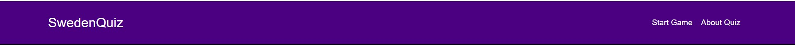

# Sweden Quiz Web Application

## Purpose

The Sweden Quiz Web Application is designed to test your knowledge about Sweden. Whether you're a resident, a tourist, or just curious, this quiz provides a fun and interactive way to learn about the country.

## Features

1. **Welcome Screen**: Introduces the quiz and provides an overview.
   
2. **Menu**: Access different sections of the quiz or get more information.
   

3. **About**: A section providing detailed information about the quiz and its purpose.
   

4. **Multiple Choice Questions**: Provides a set of questions with 4 choices each. Answer by selecting the radio button of your choice.
   

5. **Selection**: Indicates the choice that hasn't been selected for a question.
   

6. **Instant Feedback**: Once the quiz is completed, get instant feedback on your performance with scores and percentage.
   
